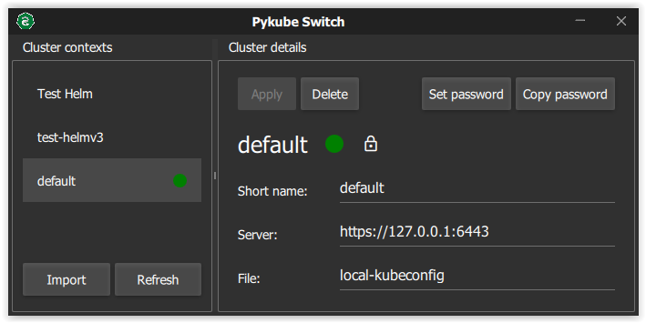

# pykube-switch

[![Quality Gate Status][sonar-project-badge]][sonar-project]

This tool help to managed multiple Kubernetes contexts (like kubectl), you can register contexts and switch easily between them.

## Technical aspects

This software is an example of Python (3.8) application with QT Quick.

One package is available in last github action. PyInstaller is used to generate the package (Windows only).

### Thanks

I use some external sources codes to develop my software. You can find the list below:
- [Font Material for qml](https://github.com/eckertj/qml-material-icons)
- [Snack Bar (Fuild part)](https://github.com/lirios/fluid)

[sonar-project]:                    https://sonarcloud.io/dashboard?id=xclemence_pykube-switch
[sonar-project-badge]:              https://sonarcloud.io/api/project_badges/measure?project=xclemence_pykube-switch&metric=alert_status

